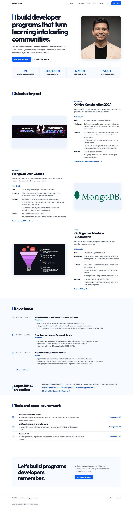
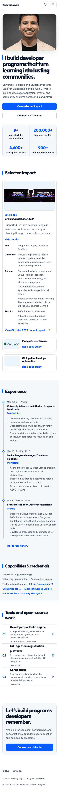
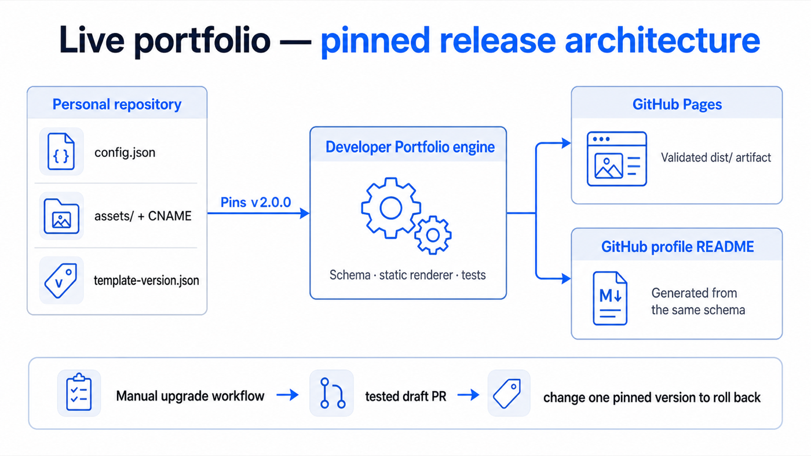

# Yashraj Nayak — portfolio content

This repository contains the personal configuration, media, custom domain, and profile integrations for [yashrajnayak.com](https://yashrajnayak.com). The reusable renderer and tests live in [Developer Portfolio](https://github.com/yashrajnayak/developer-portfolio); this site pins a tested release in `template-version.json`.

[Visit the portfolio](https://yashrajnayak.com) · [Connect on LinkedIn](https://www.linkedin.com/in/yashrajnayak/) · [View the engine release](https://github.com/yashrajnayak/developer-portfolio/releases/tag/v2.0.0)

## Preview



<details>
<summary>View the 390px mobile preview</summary>



</details>

## Content model

`config.json` is the only source for professional positioning, impact metrics, case studies, experience, capabilities, curated tools, SEO, contact links, and GitHub profile content. Personal assets live under `assets/`; no career claim is duplicated in repository scripts or static HTML.

The generated site is static before JavaScript runs. JavaScript only enhances theme selection, the mobile navigation, and responsive disclosures.

## Architecture



On every eligible change, the Pages workflow checks out the pinned engine release, validates this repository against its schema, builds a complete `dist/` site, runs unit, HTML, link, local-path, Playwright, and axe checks, then publishes with the official GitHub Pages actions.

The profile workflow uses the same generated schema output and preserves the independently refreshed `TOP-REPOS` feed in the profile repository.

## Local preview

Requirements: Git, Node.js 20 or newer, and `jq`.

```bash
git clone --depth 1 --branch "$(jq -r .version template-version.json)" \
  https://github.com/yashrajnayak/developer-portfolio.git .portfolio-engine
npm ci --prefix .portfolio-engine
PORTFOLIO_CONFIG="$PWD/config.json" \
PORTFOLIO_OUTPUT="$PWD/.portfolio-engine/dist" \
  npm --prefix .portfolio-engine run validate:all
PORTFOLIO_OUTPUT="$PWD/.portfolio-engine/dist" \
  node .portfolio-engine/scripts/serve.mjs
```

Open `http://127.0.0.1:4173`.

## Updating content

1. Edit `config.json` and assets on a branch.
2. Open a pull request and wait for `validate-site`.
3. Review the desktop and 390px screenshots.
4. Merge only after schema, static HTML, accessibility, and browser checks pass.

## Upgrading or rolling back

Run **Actions → Propose portfolio engine upgrade**. The workflow resolves a release, runs the full acceptance suite, and opens a tested draft pull request that changes only `template-version.json`.

Rollback is the same safe operation: change `template-version.json` to the previous release tag, validate, and merge. Personal content and media remain untouched.

## License

[MIT](LICENSE)
