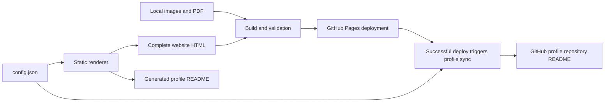

# Yashraj Nayak — personal atlas

[Live website](https://yashrajnayak.com/) · [GitHub profile](https://github.com/yashrajnayak)

A personal website about developer programs, communities and useful software. It uses a plum and paper palette, original contour artwork, a desktop project map, a compact mobile layout, company logos, one native highlights video and a YN monogram favicon.

## Edit content in one place

**`config.json` is the source of truth** for the website and profile README. Text, links, media, career entries, project lists, navigation, SEO settings and interface labels live there. `scripts/render-site.mjs` contains layout and rendering logic; `index.html` and `generated/profile-README.md` are generated outputs.

| Update | Configuration |
| --- | --- |
| Name, SEO, social card metadata | `site` |
| Intro and current roles | `hero` |
| Desktop project selector | `atlas.items` |
| Work stories, photos and video | `work.stories` |
| Shared website / README projects | `tools.projects` |
| About and company timeline | `about` |
| Contact and social links | `contact`, `footer` |
| LinkedIn PDF download | `download` |
| Profile headings and certifications | `profile` |
| Buttons and accessibility labels | `ui` |

Add a project by appending `{ "name", "description", "url", "tags" }` to `tools.projects`. Both the website and profile README will use the same name, description, link and order. Add stories and career entries to their arrays without editing HTML. A work story uses a `standard` or `split` layout and `image` or `video` media. Keep a maximum of one highlights video.

The page is rendered at build time, so visitors and search crawlers receive complete content immediately. There is no content fetch, loading screen or dependency on JavaScript for essential content. JavaScript only enhances the project selector, wordmark and video controls.

## Develop and validate

Node.js 24 is used in CI. There are no runtime npm dependencies or React components.

```sh
npm run sync:favicons
npm run build
npm run check
npm test
python3 -m http.server 8765 --bind 127.0.0.1
```

Open `http://127.0.0.1:8765`. Rebuild after editing configuration or styles. To produce the deployable folder, run `npm run build -- --output _site`.

Validation covers local assets, fragments, image dimensions, social metadata, the single-video rule, PDF validity, safe URLs and generated bundle consistency. Renderer tests exercise adding projects, stories and career entries, escaping text, invalid configuration, optional downloads and website/profile parity. Browser checks cover mobile and desktop layouts and interactive controls.

## Deployment and profile synchronization


```mermaid
flowchart LR
  Config[config.json] --> Render[Static renderer]
  Media[Local images and PDF] --> Build[Build and validation]
  Render --> HTML[Complete website HTML]
  Render --> Profile[Generated profile README]
  HTML --> Build
  Build --> Pages[GitHub Pages deployment]
  Pages --> Sync[Successful deploy triggers profile sync]
  Config --> Sync
  Sync --> ProfileRepo[GitHub profile repository README]
```

The protected `main` branch requires a pull request and the `validate-site` check. `Deploy website` builds and validates the configuration, then publishes `_site` through GitHub Pages. `CNAME` preserves the custom domain.

After a successful deployment, `Sync profile README` runs automatically. It generates the profile from the website configuration and commits only when the content differs. It can also run manually. `PROFILE_REPO_TOKEN` must have Contents write access to the repository named in `profile.repository`; missing credentials fail clearly instead of silently skipping. No star-ranking automation should write to that README.

## LinkedIn PDF

`assets/downloads/yashraj-nayak-profile.pdf` is the official LinkedIn export. The website shows its snapshot date beside the download link. To refresh it, use LinkedIn's desktop **Resources → Save to PDF**, replace this file, update `download.date`, then release. It is a snapshot and does not update itself when LinkedIn changes. Set `download.enabled` to `false` to hide the download.

## Media, favicon and search

- `assets/photos/sources.json` and `assets/video/source.json` retain source records. The Codex photograph is an unchanged 3840 × 2560 original; the native highlights video is 720p. The video appears only once.
- Company logos are in `assets/logos/`. Manrope is self-hosted with its SIL Open Font License in `assets/fonts/OFL.txt`.
- `scripts/sync-favicons.mjs` generates deterministic YN monogram assets without fetching a portrait.
- The 1200 × 630 social card is `assets/social/yashraj-nayak-card-2026.png`. Rebuild with Pillow using `python3 scripts/build-social-card.py --font path/to/licensed-font.ttf`. Its copy comes from configuration. Use a new asset filename after a visual change to avoid stale social caches.
- Canonical URLs, Open Graph / Twitter metadata, Person / WebSite structured data, robots and sitemap are generated from configuration. Keep `site.updated` accurate when making substantive changes.

`legacy/config.json` and the older section-manager files are historical reference, not active content sources. The deployed website does not load them.
