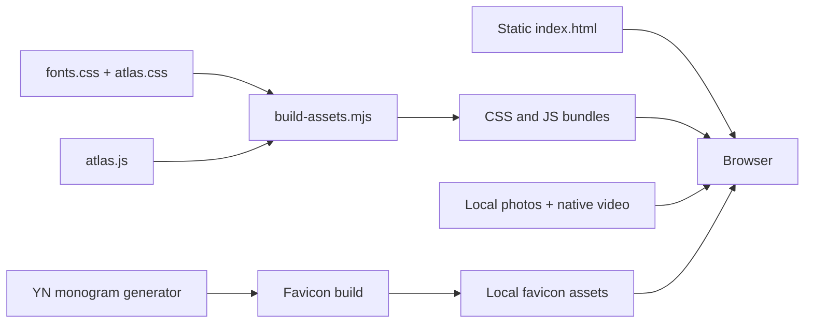

# Yashraj Nayak — personal atlas

A personal website about developer programs, communities and useful software. The redesign uses a deep plum typographic header matching the contact section, a warm paper palette, original contour artwork, a selectable project map, recent event photography and an optional particle wordmark.

The public site is [yashrajnayak.com](https://yashrajnayak.com). GitHub Pages publishes the root of the `main` branch to this custom domain.

## Develop

Requires Node.js for asset bundling and Python 3 for the example preview server.

```sh
npm run build
npm run check
npm run sync:favicons:check
python3 -m http.server 8765 --bind 127.0.0.1
```

Open `http://127.0.0.1:8765`. Edit `index.html` for content, `css/atlas.css` for presentation and `js/atlas.js` for optional interactions. Rebuild and reload after edits. The site has no React runtime or package dependencies.

## Architecture


```mermaid
flowchart LR
  HTML[Static index.html] --> Browser[Browser]
  CSS[fonts.css + atlas.css] --> Build[build-assets.mjs]
  JS[atlas.js] --> Build
  Build --> Bundles[CSS and JS bundles]
  Bundles --> Browser
  Photos[Local photos + native video] --> Browser
  Generator[YN monogram generator] --> Favicon[Favicon build]
  Favicon --> Icons[Local favicon assets]
  Icons --> Browser
```

All essential content and links are in HTML. JavaScript enhances the project selector, name animation and native video controls. The animation stops when the page becomes hidden and respects reduced motion. No GitHub API request or LinkedIn image hotlink is needed to render the homepage.

Legacy section-manager sources and historical content configuration remain in the repository as reference; they are not included in the current page bundles. The active content source is `index.html`.

## Images and fonts

- Photos are stored in `assets/photos/`. `sources.json` records publisher, public source, observed context and delivered resolution. Source records are maintained with the assets; there is no public credits page.
- The Codex group image is an unchanged 3840 × 2560 original from the existing photo archive. Other photos are LinkedIn-delivered derivatives.
- `assets/video/` contains the exact Bengaluru Tech Week highlights, downloaded through the owning channel’s YouTube Studio controls at 720p. The video appears once, in the Bengaluru Tech Week story; the project selector uses a still photograph. A native player provides playback without YouTube overlays; `source.json` records provenance.
- `assets/atlas-contours.svg` is original abstract contour artwork, not real geographic data.
- Manrope is self-hosted under the SIL Open Font License, included in `assets/fonts/OFL.txt`.

## Favicon automation

`scripts/sync-favicons.mjs` generates a geometric YN monogram in SVG, PNG and ICO formats without network access or a portrait. The workflow runs on demand and when the generator changes. Cache-busting URLs are updated deterministically.

## Validation and release

`npm run check` verifies local asset references, fragment destinations, metadata, image attributes, photo credit records and regenerated bundle consistency. Browser checks should cover phone, tablet and desktop widths, keyboard selection, native video playback and pause controls, the name effect and console errors. A static check is not a full accessibility or performance audit.

Run the build and validation commands above before committing. Push approved releases to `main`, then verify the GitHub Pages build and the live domain. `CNAME` preserves the custom domain.

## Profile README

`.github/workflows/update-profile-readme.js` generates the companion GitHub profile README with current APJ student-programs, Bengaluru Tech Week and Codex work. It preserves the profile repository's `TOP-REPOS` markers and ranked repository section. The cross-repository workflow needs `PROFILE_REPO_TOKEN`; it skips the update if that credential is unavailable.

The site README is maintained directly. Its legacy config-based generator leaves this atlas version unchanged.
